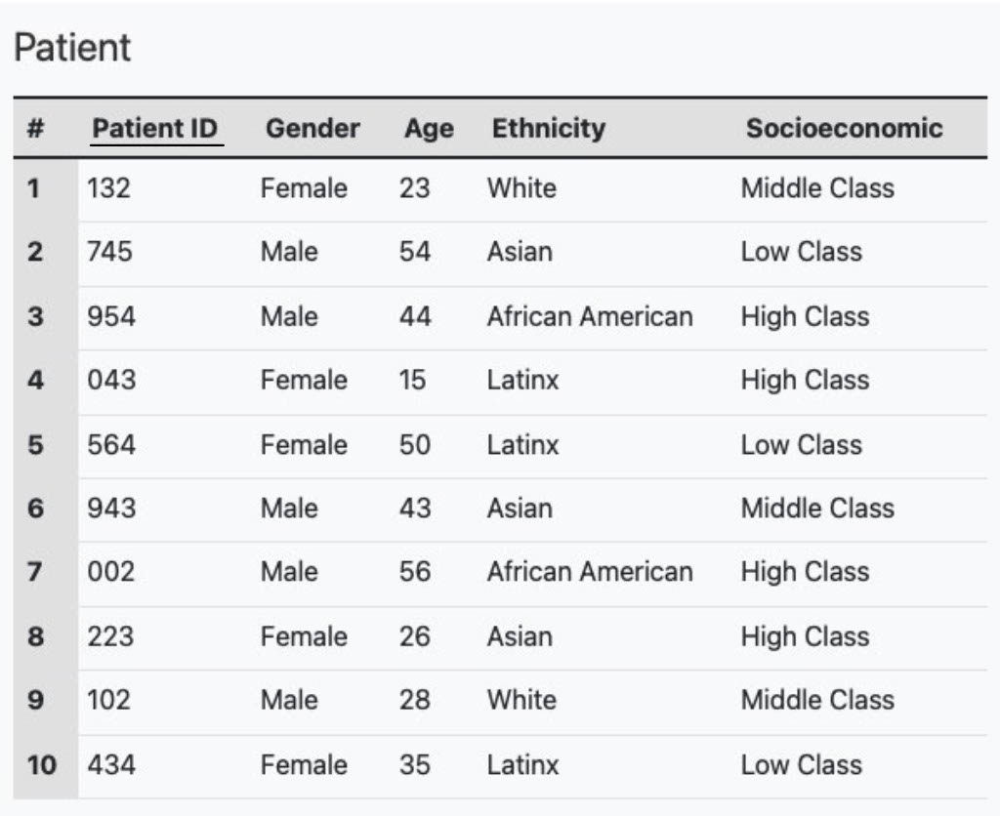

# Problem Statement
## Authors: Lazaro Camero, Khoi Tran, Mir Ali

## Introduction

In light of today’s modern society, scientists around the world are innovating new ways
to combat illnesses and prolong the human lifespan. One approach to this is identifying
what influences population health - in other words, recognizing predictors of health, such
as race and gender. Studies around the globe show that racial and ethnic minority groups
experience higher rates of illnesses and deaths across a wide range of health conditions,
such as diabetes, hypertension, obesity, and heart-related diseases, when compared to their
White counterparts. In addition, the role of gender can impact the health outcomes of an
individual as it often is associated with health behaviors such as physical activity.
The main focus of this project will investigate how particular diseases spread among different racial and gender groups. It’s important to remember that people of different races mix in today’s culture, so illnesses that affect, for instance, a group of Africans particularly may also affect, to some extent, a group of people who have some African in them. Studies have revealed that some diseases can develop over the course of a person’s life, while some diseases are more likely to affect particular ethnic groups.
The biology department at Virginia Commonwealth University is in need of a database that allows for a quick and easy retrieval of data associated with certain key concepts or names and attributes. It seems like they have too much data everywhere in their system,
making it difficult for them to group their patients into their corresponding type of disease and treatments for them. Data is to be stored about patients, diseases, ages, and doctor’s appointment. This data includes the disease name, complications, activity habits, and family history, Data to be stored about the patients include location in between doctor’s appointments, patient’s ID, date when they weren’t visiting the doctor. Data stored about the doctor’s visit include the date the patients visited the doctors, and time.

# Database Description
We will use various data sets for this project’s entities, such as diseases, people, gender, ages, and doctor’s appointments, to create linkages between them. We want to be able to retrieve certain information based on specified attributes, hence the goal of our project is to build a database to find the linkages between the entities. For instance, if we need to obtain information about a primary key, we can just type its ID into the data set and receive all of the pertinent details.
There are five entities in our system, each with unique properties and primary keys that define data sets. We are able to establish relationships between the entities using these entities, such as Person to Doctor. We will be able to use queries to discover specific information thanks to the development of this database. 

# ER Diagram

<!--  -->