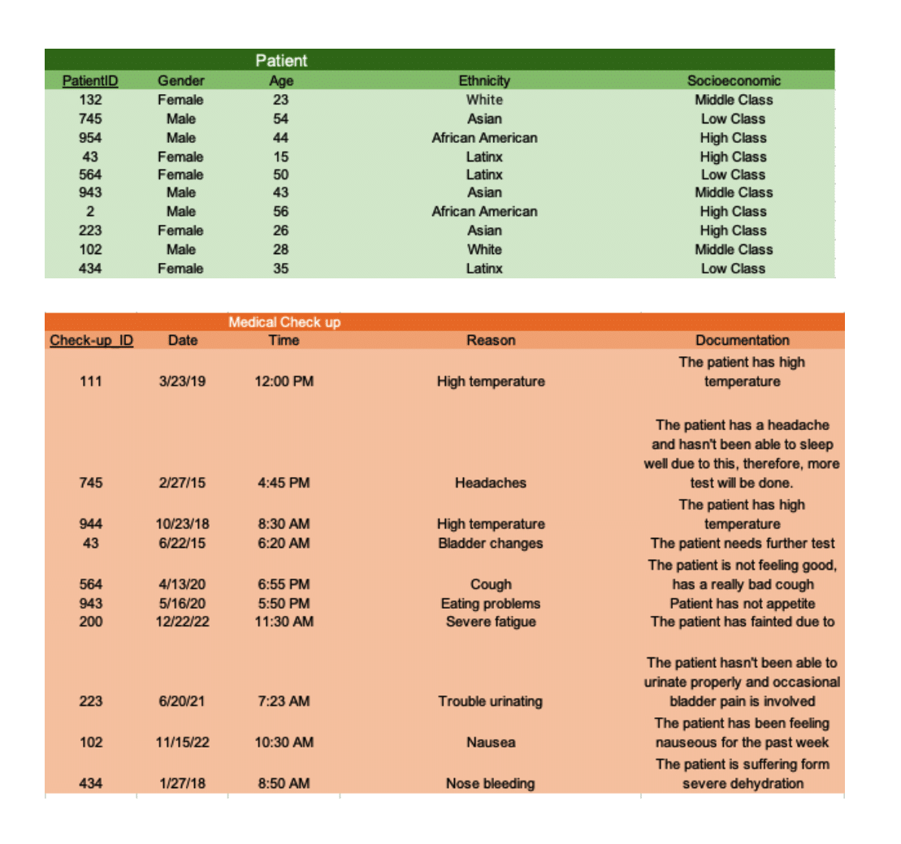
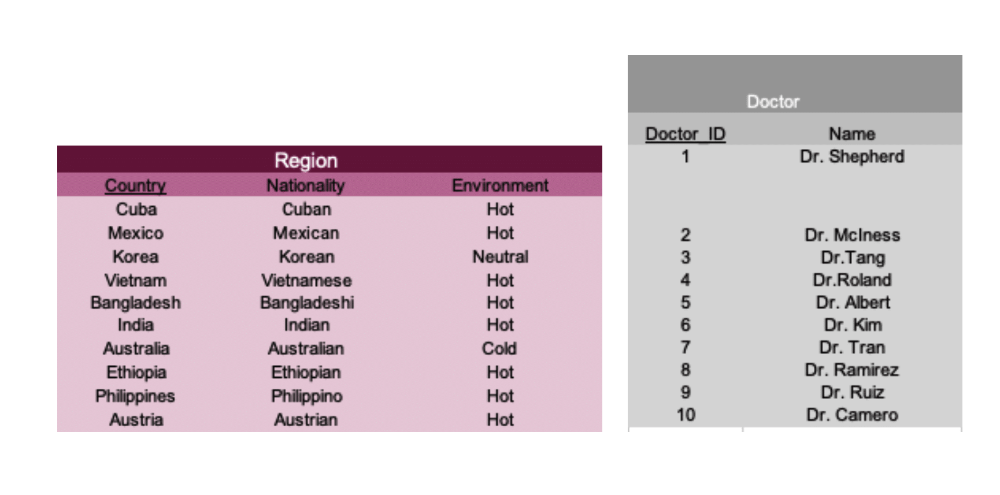

# Problem Statement
## Authors: Lazaro Camero, Khoi Tran, Mir Ali

## Introduction

In light of today’s modern society, scientists around the world are innovating new ways to combat illnesses and prolong the human lifespan. One approach to this is identifying what influences population health - in other words, recognizing predictors of health, such as race and gender. Studies around the globe show that racial and ethnic minority groups experience higher rates of illnesses and deaths across a wide range of health conditions, such as diabetes, hypertension, obesity, and heart-related diseases, when compared to their White counterparts. In addition, the role of gender can impact the health outcomes of an individual as it often is associated with health behaviors such as physical activity. 
&nbsp; &nbsp; &nbsp; &nbsp;The main focus of this project will investigate how particular diseases spread among different racial and gender groups. It’s important to remember that people of different races mix in today’s culture, so illnesses that affect, for instance, a group of Africans particularly may also affect, to some extent, a group of people who have some African in them. Studies have revealed that some diseases can develop over the course of a person’s life, while some diseases are more likely to affect particular ethnic groups. 
&nbsp; &nbsp; &nbsp; &nbsp;The biology department at Virginia Commonwealth University is in need of a database that allows for a quick and easy retrieval of data associated with certain key concepts or names and attributes. It seems like they have too much data everywhere in their system, making it difficult for them to group their patients into their corresponding type of disease and treatments for them. Data is to be stored about patients, diseases, ages, and doctor’s appointment. This data includes the disease name, complications, activity habits, and family history, Data to be stored about the patients include location in between doctor’s appointments, patient’s ID, date when they weren’t visiting the doctor. Data stored about the doctor’s visit include the date the patients visited the doctors, and time.

## Database Description
We will use various data sets for this project’s entities, such as diseases, people, gender, ages, and doctor’s appointments, to create linkages between them. We want to be able to retrieve certain information based on specified attributes, hence the goal of our project is to build a database to find the linkages between the entities. For instance, if we need to obtain information about a primary key, we can just type its ID into the data set and receive all of the pertinent details. 
&nbsp; &nbsp; &nbsp; &nbsp;There are five entities in our system, each with unique properties and primary keys that define data sets. We are able to establish relationships between the entities using these entities, such as Person to Doctor. We will be able to use queries to discover specific information thanks to the development of this database. 

# ER Diagram

A database is in Boyce-Codd Normal Form if every non-prime attribute depends on every other prime attribute and there is no functional redundancy. You can see that this is how our diagram is constructed based on the concept of a BCNF as each non-prime attribute exclusively depends on the prime attribute that distinguishes each schema. A database is in 4NF if there are no multi-value dependencies and based on this diagram, we don't have any multi-value dependencies. A database is 4NF if there are no multi-value dependencies, and according to this diagram, there aren't any.

# Relational Schemas
Patient (<ins>Patient ID</ins>, gender, age, ethnicity, socioeconomic) 
Gets(<ins>Patient ID,....</ins>) 
Medical_CheckUp(<ins>Patient ID</ins>, date, time, reason, documentation) 
Diagnose(<ins>Patient_ID,Name</ins>) 
Disease (<ins>Name</ins>, Type, transmission, communicable, fatality) 
Region (<ins>Country</ins>, Nationality, Environment) 
Present(<ins>Country, Name</ins>) 
Treatment (<ins>Treatment ID</ins>, stage, cost, treatment_Opt) 
DiseaseChkUp(<ins>CheckUp_ID,Disease_ID</ins>) 
Location(<ins>Patient_ID, Country</ins>) 
Disease_CheckUp(<ins>CheckUp_ID,Disease_ID</ins>) 
DrCheckUp(<ins>Dr_ID,CheckUp_ID</ins>) 

# Functional Dependency
Patient_ID -> gender, age, ethnicity, socioeconomic 
Patient_ID, ->  
Patient_ID -> date, time, reason, documentation 
Patient_ID,Name ->  
Name -> Type, transmission, communicable, fatality 
Country -> Nationality, Environment 
Country,Name -> 
Treatment_ID -> stage, cost, treatment_Opt 
CheckUp_ID,Disease_ID ->
Patient_ID,Country ->  
CheckUp_ID,Dr_ID -> 

The listing of relations is shown in the relational schemas and functional dependencies above. You can also see the entities attributes as well as their domain and type. Constraints are a set of guidelines that make sure the consistency of the data is not disrupted when an authorized user alters the database. The domain of each relationship is shown in the relational schemas and functional dependencies above, and the primary keys are underlined. My foreign keys serve as the distinguishing identifiers between the two connected tables; as an illustration, think of the relationship between Patient ID and Country and Region.

# Queries
1. What stage of cancer of this patient in?
2. The cost of the Alzheimer’s treatment?
3. How many people have this disease?
4. What is the fatality rate of COVID in Mexico?
5. What treatment is viable for Ebola?
6. What date did this patient receive their check-up in the hospital?
7. What is the “transmission” value for the flu?
8. How many Asian people have the mad cow disease?
9. What is the curability of stage II Leukemia?
10. When is the next medical checkup for this specific person?
11. What is the socioeconomic of this patient?
12. What is this patient’s medical history?
13. What is the reason for this patient’s medical checkup?
14. What type of disease is E.Coli?
15. What is the environmental status of Egypt?
16. How many people from the USE got their medical checkups in the year 2020?
17. Are there cases of Ebola in environments below 50 Fahrenheit?
18. What are this patient’s medical notes?
19. Does Parkinson’s disease affect Asian people more so than European?
20. Does diabetes affect Asian people more than arthritis?

# Sample Data

<!-- <!--  -->

<!--  -->
